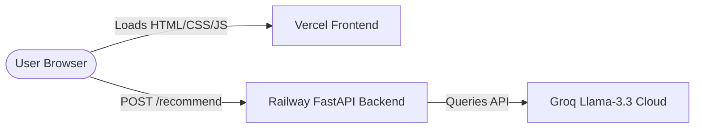

# Deployment Guide

This guide outlines the steps to deploy the Restaurant Recommendation System by splitting the application into a **decoupled architecture**:
1. **Backend API:** Deployed on **Railway** (Python/FastAPI)
2. **Frontend UI:** Deployed on **Vercel** (HTML/CSS/JS Static Host)

---

## 1. Decoupled Architecture Overview

When deployed, the frontend and backend run on different domains:
*   **Frontend:** `https://your-app-name.vercel.app`
*   **Backend:** `https://your-backend-name.up.railway.app`



To facilitate this cross-domain communication, the project has been updated with **CORS Middleware enabled** on the FastAPI backend and a configurable **API Base URL** on the frontend.

---

## 2. Step 1: Deploying the Backend on Railway

Railway will automatically detect the [Dockerfile](file:///c:/Users/Vaibhav%20Singh/.cursor/restaurant-recommender/Dockerfile) in the root of your project and spin up a container.

### Step-by-Step Instructions:
1.  **Sign In:** Go to [Railway.app](https://railway.app) and sign in with GitHub.
2.  **Create Project:** Click **New Project** -> **Deploy from GitHub repo**.
3.  **Configure Repo:** Select your repository containing this codebase.
4.  **Add Environment Variables:** In the Railway dashboard under the **Variables** tab for the service, add the following key-value pairs:
    *   `GROQ_API_KEY`: *Your Groq Cloud API Key* (get one from [Groq Console](https://console.groq.com))
    *   `USE_LOCAL_DATASET`: `True` *(Loads our custom 600-restaurant Delhi sub-areas dataset)*
    *   `MAX_CANDIDATES`: `20`
    *   `TOP_RECOMMENDATIONS`: `5`
5.  **Build and Deploy:** Railway will automatically build the container using the Dockerfile and deploy it.
6.  **Set Domain:** Go to the **Settings** tab in Railway, click **Generate Domain** under the *Networking* section, and copy the generated URL (e.g., `https://restaurant-recommender-production.up.railway.app`).

### Verify Deployment:
Open a browser and go to your Railway URL's health check:
`https://your-backend-name.up.railway.app/health`

It should return a healthy status JSON:
```json
{
  "status": "healthy",
  "dataset": {
    "loaded": true,
    "restaurant_count": 600,
    "locations_count": 9,
    "cuisines_count": 134
  }
}
```

---

## 3. Step 2: Preparing the Frontend for Vercel

Before deploying the frontend, you must point the client-side JavaScript to your deployed Railway backend URL.

### Step-by-Step Instructions:
1.  Open the [app.js](file:///c:/Users/Vaibhav%20Singh/.cursor/restaurant-recommender/app/ui/static/app.js) file.
2.  Locate the `API_BASE_URL` configuration block at the top of the file:
    ```javascript
    // API Configuration: Set your Railway backend URL here in production
    const API_BASE_URL = window.location.hostname === "localhost" || window.location.hostname === "127.0.0.1"
        ? ""
        : "https://your-backend-railway-url.up.railway.app";
    ```
3.  Replace `https://your-backend-railway-url.up.railway.app` with the actual domain URL generated by Railway (e.g., `https://restaurant-recommender-production.up.railway.app`).
4.  Commit and push this change to your repository.

---

## 4. Step 3: Deploying the Frontend on Vercel

Vercel will host the static frontend assets (`index.html`, `styles.css`, `app.js`) and direct routing using the provided [vercel.json](file:///c:/Users/Vaibhav%20Singh/.cursor/restaurant-recommender/vercel.json) file.

### Step-by-Step Instructions:
1.  **Sign In:** Log in to [Vercel.com](https://vercel.com) using your GitHub account.
2.  **Add Project:** Click **Add New** -> **Project** and import your GitHub repository.
3.  **Configure Project:**
    *   **Framework Preset:** Select `Other`
    *   **Root Directory:** Keep as the default root `/` *(the `vercel.json` file in the root will automatically route traffic to the `app/ui/static` subdirectory)*
4.  **Deploy:** Click **Deploy**. Vercel will process the static routes and make your frontend live within seconds.

---

## 5. Troubleshooting & FAQ

#### 1. Red Connection Dot (System Offline)
*   **Cause:** The frontend is unable to ping the Railway backend, or the backend is still booting.
*   **Resolution:** Verify the `API_BASE_URL` in `app.js` matches the Railway URL exactly (with `https://` and no trailing slash). Check the Railway logs under the *Deployments* tab for any startup errors.

#### 2. CORS Errors in Browser Console
*   **Cause:** The backend is rejecting cross-domain requests.
*   **Resolution:** Verify that `CORSMiddleware` in `app/main.py` is configured correctly and deployed. Railway compiles modifications upon git pushes.

#### 3. Recommendation Fails / Invalid Key
*   **Cause:** The backend cannot reach the Groq API due to a missing or invalid API key.
*   **Resolution:** Verify that the `GROQ_API_KEY` is added to the Railway environment variables and is active.
