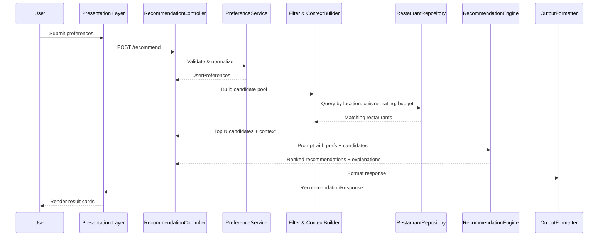

# Architecture: AI-Powered Restaurant Recommendation System

> Derived from [context.md](./context.md). This document defines the system design for a Zomato-inspired recommendation service that combines structured restaurant data with LLM-based ranking and explanation.

---

## 1. Architecture Overview

The system follows a **layered, pipeline-oriented architecture** with a clear separation between data handling, business logic, AI reasoning, and presentation.

```
┌─────────────────────────────────────────────────────────────────────────┐
│                         PRESENTATION LAYER                              │
│              (Web UI / CLI — preference form + results view)            │
└─────────────────────────────────┬───────────────────────────────────────┘
                                  │ HTTP / in-process calls
┌─────────────────────────────────▼───────────────────────────────────────┐
│                         APPLICATION LAYER                               │
│   RecommendationController  →  orchestrates end-to-end request flow     │
└─────────────────────────────────┬───────────────────────────────────────┘
                                  │
        ┌─────────────────────────┼─────────────────────────┐
        │                         │                         │
        ▼                         ▼                         ▼
┌───────────────┐       ┌─────────────────┐       ┌─────────────────┐
│  Preference   │       │   Filtering &   │       │  Recommendation │
│   Service     │       │  Context Builder│       │     Engine      │
│  (validate)   │       │  (narrow pool)  │       │  (LLM rank +    │
└───────────────┘       └────────┬────────┘       │   explain)      │
                                 │                └────────┬────────┘
                                 │                         │
                                 ▼                         ▼
                       ┌─────────────────┐       ┌─────────────────┐
                       │  Data Access    │       │   LLM Client    │
                       │  Layer (DAL)    │       │     (Groq)      │
                       └────────┬────────┘       └─────────────────┘
                                │
                                ▼
                       ┌─────────────────┐
                       │  Restaurant     │
                       │  Repository     │
                       │  (in-memory /   │
                       │   local store)  │
                       └────────┬────────┘
                                │
                                ▼
                       ┌─────────────────┐
                       │  Data Pipeline  │
                       │  (Hugging Face  │
                       │   ingestion)    │
                       └─────────────────┘
```

### Design Principles

| Principle | Rationale |
|-----------|-----------|
| **Filter before LLM** | Reduce token cost and latency by passing only relevant candidates to the model |
| **Structured in, structured out** | LLM receives JSON-like context and returns parseable rankings + explanations |
| **Single orchestration path** | One controller coordinates ingestion → filter → prompt → display |
| **Fail gracefully** | Fallback to rule-based ranking if LLM is unavailable |
| **Stateless requests** | Each recommendation request is independent; dataset loaded once at startup |

---

## 2. Component Architecture

### 2.1 Data Pipeline (Ingestion & Preprocessing)

**Responsibility:** Load the Zomato dataset from Hugging Face, normalize fields, and expose a queryable in-memory or local store.

| Sub-component | Description |
|---------------|-------------|
| `DatasetLoader` | Fetches `ManikaSaini/zomato-restaurant-recommendation` via `datasets` library |
| `Preprocessor` | Cleans nulls, normalizes cuisine strings, maps cost to budget tiers, parses ratings |
| `RestaurantRepository` | Indexed store for fast lookup by location, cuisine, rating, and cost |

**Extracted fields (from context):**

- `name` — restaurant name
- `location` — city/area (e.g., Delhi, Bangalore)
- `cuisine` — primary or comma-separated cuisines
- `cost` — estimated cost for two / price range
- `rating` — aggregate rating score

**Preprocessing rules:**

```
location  → lowercase, trim, alias map (e.g., "Bengaluru" → "bangalore")
cuisine   → split on comma, lowercase, dedupe
cost      → map to budget tier: low | medium | high (percentile or fixed thresholds)
rating    → float, clamp 0–5, drop invalid rows
name      → trim, dedupe by name+location
```

**Startup flow:**

1. Load dataset from Hugging Face (cache locally after first fetch)
2. Run preprocessing pipeline
3. Build indexes: `by_location`, `by_cuisine`, `by_budget_tier`
4. Mark repository as ready; serve requests

---

### 2.2 Preference Capture (User Input)

**Responsibility:** Collect, validate, and normalize user preferences before filtering.

**Input schema:**

```json
{
  "location": "Delhi",
  "budget": "medium",
  "cuisine": "Italian",
  "min_rating": 4.0,
  "additional_preferences": "family-friendly, quick service"
}
```

| Field | Type | Validation |
|-------|------|------------|
| `location` | string | Required; must match known cities in dataset |
| `budget` | enum | `low` \| `medium` \| `high` |
| `cuisine` | string | Required; fuzzy match against known cuisines |
| `min_rating` | float | Optional; 0–5, default 0 |
| `additional_preferences` | string | Optional; free text passed to LLM |

**Sub-components:**

- `PreferenceValidator` — schema validation, enum checks, location/cuisine existence
- `PreferenceNormalizer` — canonical forms for filtering (e.g., budget tier, location key)

---

### 2.3 Integration Layer (Filtering & Context Builder)

**Responsibility:** Narrow the full dataset to a candidate pool and format it for the LLM.

**Filtering pipeline (sequential, AND logic):**

```
ALL restaurants
  → filter by location
  → filter by cuisine (contains / fuzzy)
  → filter by min_rating
  → filter by budget tier
  → sort by rating desc
  → take top N (e.g., 15–20) for LLM context
```

| Parameter | Default | Purpose |
|-----------|---------|---------|
| `MAX_CANDIDATES` | 20 | Cap tokens sent to LLM |
| `MIN_CANDIDATES` | 3 | If fewer, relax filters (e.g., drop cuisine constraint) |

**Context Builder output (per candidate):**

```json
{
  "id": "r_1042",
  "name": "Trattoria Roma",
  "location": "Delhi",
  "cuisine": "Italian",
  "rating": 4.3,
  "estimated_cost": "₹800 for two",
  "budget_tier": "medium"
}
```

**Sub-components:**

- `RestaurantFilter` — applies hard filters from preferences
- `CandidateSelector` — ranks and truncates to top N
- `PromptContextBuilder` — serializes candidates + user prefs into LLM-ready structure

---

### 2.4 Recommendation Engine (LLM Integration)

**Responsibility:** Use an LLM to rank candidates, explain choices, and optionally summarize.

#### Prompt structure

```
SYSTEM:
  You are a restaurant recommendation assistant for Indian cities.
  Rank restaurants based on user preferences. Be concise and helpful.

USER:
  Preferences:
  - Location: {location}
  - Budget: {budget}
  - Cuisine: {cuisine}
  - Minimum rating: {min_rating}
  - Additional: {additional_preferences}

  Candidate restaurants (JSON):
  {candidates_json}

  Return JSON with:
  - summary: one-paragraph overview
  - recommendations: array of top 5, each with:
      rank, restaurant_id, name, cuisine, rating, estimated_cost, explanation
```

#### Expected LLM response schema

```json
{
  "summary": "Based on your preference for Italian food in Delhi...",
  "recommendations": [
    {
      "rank": 1,
      "restaurant_id": "r_1042",
      "name": "Trattoria Roma",
      "cuisine": "Italian",
      "rating": 4.3,
      "estimated_cost": "₹800 for two",
      "explanation": "Highly rated Italian spot within your medium budget..."
    }
  ]
}
```

**Sub-components:**

| Component | Role |
|-----------|------|
| `PromptTemplate` | Versioned prompt with placeholders |
| `LLMClient` | Groq API client via official `groq` Python SDK |
| `ResponseParser` | Parse JSON; validate against schema; handle malformed output |
| `FallbackRanker` | Rule-based ranking if LLM fails (sort by rating + budget match) |

**LLM provider: Groq**

Groq is the sole LLM provider for this project. It offers fast inference via the GroqCloud API and supports open-weight models well suited to structured JSON output.

**Groq configuration:**

- SDK: [`groq`](https://github.com/groq/groq-python) Python package
- API endpoint: `https://api.groq.com/openai/v1` (OpenAI-compatible chat completions)
- Default model: `llama-3.3-70b-versatile` (strong reasoning + JSON adherence)
- Alternative model: `llama-3.1-8b-instant` (lower latency, lighter workloads)
- Temperature: low (0.2–0.4) for consistent rankings
- Max tokens: ~1500 for 5 recommendations + summary
- Retry: 1 retry on parse failure with stricter JSON instruction

**`LLMClient` implementation (Groq):**

```python
from groq import Groq

client = Groq(api_key=settings.GROQ_API_KEY)
response = client.chat.completions.create(
    model=settings.GROQ_MODEL,
    messages=[{"role": "system", "content": system_prompt},
              {"role": "user", "content": user_prompt}],
    temperature=0.3,
    response_format={"type": "json_object"},  # when supported by model
)
```

---

### 2.5 Output Display (Presentation Layer)

**Responsibility:** Render recommendations in a clear, user-friendly format.

**Displayed fields (per context success criteria):**

| Field | Source |
|-------|--------|
| Restaurant Name | LLM response (validated against candidate) |
| Cuisine | LLM response |
| Rating | LLM response |
| Estimated Cost | LLM response |
| AI-generated explanation | LLM response |
| Optional summary | LLM top-level summary |

**UI options (pick one for MVP):**

1. **Streamlit / Gradio** — fastest path to demo
2. **FastAPI + simple HTML/JS** — lightweight web app
3. **CLI** — for development and testing

**Result card layout (conceptual):**

```
┌──────────────────────────────────────────────┐
│ #1  Trattoria Roma                    ★ 4.3 │
│ Italian · Medium budget · ₹800 for two      │
│                                              │
│ "Highly rated Italian spot within your       │
│  medium budget, ideal for family dining."    │
└──────────────────────────────────────────────┘
```

---

## 3. End-to-End Data Flow



**Request lifecycle:**

1. User submits preference form
2. Controller validates input
3. Filter queries repository → 15–20 candidates
4. Context builder assembles prompt payload
5. LLM ranks and explains top 5
6. Parser validates LLM JSON against known candidate IDs
7. Formatter maps to display DTO
8. UI renders cards + optional summary

---

## 4. Data Models

### 4.1 Domain entities

```python
# Conceptual models (language-agnostic)

Restaurant:
  id: str
  name: str
  location: str
  cuisine: list[str]
  rating: float
  estimated_cost: str
  budget_tier: enum[low, medium, high]

UserPreferences:
  location: str
  budget: enum[low, medium, high]
  cuisine: str
  min_rating: float = 0.0
  additional_preferences: str | None = None

Recommendation:
  rank: int
  restaurant_id: str
  name: str
  cuisine: str
  rating: float
  estimated_cost: str
  explanation: str

RecommendationResponse:
  summary: str | None
  recommendations: list[Recommendation]
  metadata: dict  # e.g., candidate_count, filters_applied
```

### 4.2 API contract

**Request — `POST /api/v1/recommend`**

```json
{
  "location": "Bangalore",
  "budget": "high",
  "cuisine": "Chinese",
  "min_rating": 4.0,
  "additional_preferences": "quick service"
}
```

**Response — `200 OK`**

```json
{
  "summary": "...",
  "recommendations": [
    {
      "rank": 1,
      "restaurant_id": "r_882",
      "name": "Golden Dragon",
      "cuisine": "Chinese",
      "rating": 4.5,
      "estimated_cost": "₹1200 for two",
      "explanation": "..."
    }
  ],
  "metadata": {
    "candidates_considered": 18,
    "filters_applied": ["location", "cuisine", "min_rating", "budget"]
  }
}
```

**Error responses:**

| Code | Condition |
|------|-----------|
| `400` | Invalid preferences (unknown location, bad enum) |
| `404` | No restaurants match after filter relaxation |
| `502` | LLM unavailable; return fallback rankings if possible |
| `500` | Unexpected internal error |

---

## 5. Technology Stack (Recommended)

| Layer | Technology | Notes |
|-------|------------|-------|
| Language | Python 3.11+ | Strong HF + LLM ecosystem |
| Dataset | `datasets` (Hugging Face) | Load `ManikaSaini/zomato-restaurant-recommendation` |
| Data store | In-memory (pandas / list) | Sufficient for single dataset; no DB required for MVP |
| API | FastAPI | Async, OpenAPI docs, easy testing |
| LLM | **Groq** (`groq` SDK) | Fast inference; OpenAI-compatible chat completions API |
| UI | Streamlit or Gradio | Rapid prototyping; swap for React later |
| Config | `.env` + pydantic-settings | API keys, model name, candidate limits |
| Testing | pytest | Unit tests for filter, parser, fallback |

---

## 6. Project Structure

```
restaurant-recommender/
├── app/
│   ├── main.py                 # FastAPI / Streamlit entry
│   ├── config.py               # Settings & env vars
│   ├── controllers/
│   │   └── recommendation_controller.py
│   ├── services/
│   │   ├── preference_service.py
│   │   ├── filter_service.py
│   │   ├── context_builder.py
│   │   └── recommendation_engine.py
│   ├── data/
│   │   ├── loader.py           # Hugging Face ingestion
│   │   ├── preprocessor.py
│   │   └── repository.py
│   ├── llm/
│   │   ├── client.py
│   │   ├── prompts.py
│   │   └── parser.py
│   ├── models/
│   │   ├── restaurant.py
│   │   ├── preferences.py
│   │   └── recommendation.py
│   └── ui/
│       └── components.py       # Form + result cards
├── tests/
│   ├── test_filter.py
│   ├── test_parser.py
│   └── test_repository.py
├── docs/
│   ├── context.md
│   └── architecture.md
├── .env.example
├── requirements.txt
└── README.md
```

---

## 7. Cross-Cutting Concerns

### 7.1 Configuration

```env
HF_DATASET=ManikaSaini/zomato-restaurant-recommendation
GROQ_API_KEY=gsk_...
GROQ_MODEL=llama-3.3-70b-versatile
MAX_CANDIDATES=20
TOP_RECOMMENDATIONS=5
```

### 7.2 Error handling & resilience

- **Empty filter results:** Relax constraints in order: cuisine → min_rating → budget
- **LLM timeout:** 30s timeout; fall back to `FallbackRanker`
- **Malformed LLM JSON:** Retry once; then fallback
- **Startup failure:** Log dataset load errors; refuse to serve until data is ready

### 7.3 Observability

- Log: request ID, filter counts, LLM latency, token usage
- Metrics (optional): requests/sec, LLM error rate, avg candidates per query

### 7.4 Security

- `GROQ_API_KEY` in environment only; never in source control
- Rate-limit public endpoints if deployed
- Sanitize free-text `additional_preferences` before prompt injection (strip control chars, length cap)

---

## 8. Deployment Architecture

### MVP (local / demo)

```
Developer machine
  └── python -m streamlit run app/main.py
        ├── In-memory dataset (loaded at startup)
        └── Groq API calls via HTTPS (api.groq.com)
```

### Production (optional extension)

```
┌─────────────┐     ┌─────────────┐     ┌─────────────┐
│   CDN/UI    │────▶│  API Server │────▶│  Groq API   │
│  (Static)   │     │  (FastAPI)  │     │ (GroqCloud) │
└─────────────┘     └──────┬──────┘     └─────────────┘
                           │
                    ┌──────▼──────┐
                    │ Cached JSON │
                    │  (dataset)  │
                    └─────────────┘
```

- Pre-process dataset at build time → ship as `data/restaurants.json`
- Containerize with Docker; deploy to Railway, Render, or similar
- Health check: `GET /health` returns dataset loaded + Groq API reachable

---

## 9. Implementation Phases

| Phase | Scope | Deliverable |
|-------|-------|-------------|
| **P1 — Data** | Load HF dataset, preprocess, repository | Queryable in-memory store |
| **P2 — Filter** | Preference validation + candidate selection | Filter service with tests |
| **P3 — LLM** | Groq client, prompt, parser, fallback | End-to-end ranking via Groq API |
| **P4 — UI** | Preference form + result cards | Working demo app |
| **P5 — Polish** | Error handling, logging, README | Production-ready MVP |

---

## 10. Mapping to Context Requirements

| Context requirement | Architecture component |
|---------------------|----------------------|
| Load Zomato dataset from Hugging Face | `DatasetLoader` + `Preprocessor` |
| Extract name, location, cuisine, cost, rating | `Restaurant` model + preprocessing rules |
| Collect location, budget, cuisine, rating, extras | `PreferenceService` + UI form |
| Filter data based on user input | `RestaurantFilter` + `CandidateSelector` |
| Pass structured results to LLM prompt | `PromptContextBuilder` |
| LLM ranks, explains, summarizes | `RecommendationEngine` + Groq `LLMClient` + `PromptTemplate` |
| Display name, cuisine, rating, cost, explanation | `OutputFormatter` + UI result cards |

---

## 11. Open Decisions

| Decision | Options | Recommendation |
|----------|---------|------------------|
| UI framework | Streamlit vs Gradio vs React | Streamlit for MVP speed |
| LLM provider | — | **Decided: Groq** (`llama-3.3-70b-versatile`) |
| Budget tier mapping | Percentile vs fixed ₹ thresholds | Fixed thresholds tuned after inspecting dataset |
| Persistence | In-memory vs SQLite | In-memory for MVP; SQLite if dataset grows |

---

*Last updated: derived from [context.md](./context.md)*
