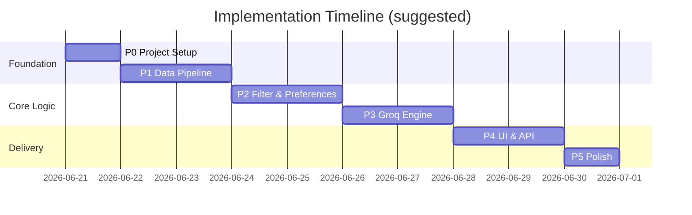
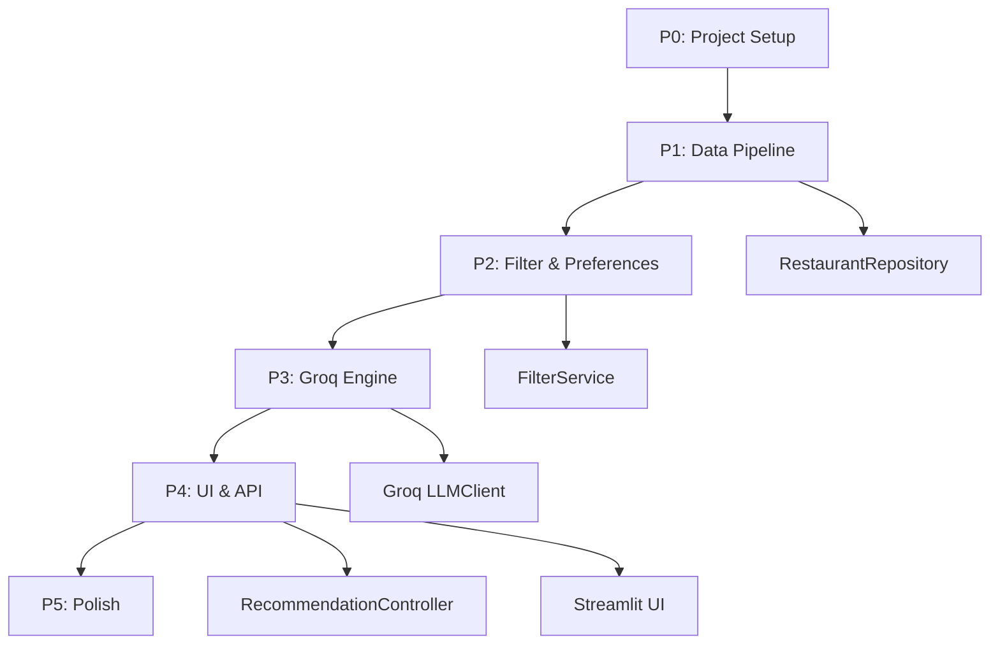

# Phase-Wise Implementation Plan

> AI-Powered Restaurant Recommendation System (Zomato use case)  
> Based on [context.md](./context.md) and [architecture.md](./architecture.md)

---

## Executive Summary

This plan breaks implementation into **5 sequential phases**. Each phase produces a testable deliverable and maps directly to the system workflow defined in the project context.

| Phase | Name | Primary outcome | Depends on |
|-------|------|-----------------|------------|
| **P0** | Project setup | Runnable repo skeleton | — |
| **P1** | Data pipeline | Queryable restaurant store | P0 |
| **P2** | Filtering & preferences | Candidate selection from user input | P1 |
| **P3** | Groq recommendation engine | AI-ranked results with explanations | P2 |
| **P4** | UI & API integration | End-to-end demo app | P3 |
| **P5** | Polish & hardening | Production-ready MVP | P4 |

**LLM provider (decided):** Groq — `llama-3.3-70b-versatile` via official `groq` SDK.

---

## Phase Overview



---

## P0 — Project Setup

**Goal:** Establish project structure, dependencies, and configuration so later phases can be built incrementally.

### Tasks

| # | Task | Output |
|---|------|--------|
| 0.1 | Create repository folder structure per architecture | `restaurant-recommender/` tree |
| 0.2 | Add `requirements.txt` | `datasets`, `pandas`, `pydantic`, `pydantic-settings`, `python-dotenv`, `groq`, `fastapi`, `uvicorn`, `streamlit`, `pytest` |
| 0.3 | Add `.env.example` | `GROQ_API_KEY`, `GROQ_MODEL`, `HF_DATASET`, `MAX_CANDIDATES`, `TOP_RECOMMENDATIONS` |
| 0.4 | Implement `app/config.py` | Pydantic `Settings` class loading env vars |
| 0.5 | Add domain model stubs | `app/models/restaurant.py`, `preferences.py`, `recommendation.py` |
| 0.6 | Add `README.md` with setup instructions | Clone, venv, install, env setup |
| 0.7 | Configure `.gitignore` | `.env`, `__pycache__`, `.pytest_cache`, HF cache |

### Files to create

```
restaurant-recommender/
├── app/
│   ├── __init__.py
│   ├── config.py
│   └── models/
│       ├── __init__.py
│       ├── restaurant.py
│       ├── preferences.py
│       └── recommendation.py
├── tests/
│   └── __init__.py
├── docs/                       # symlink or copy from .cursor/docs
├── .env.example
├── .gitignore
├── requirements.txt
└── README.md
```

### Acceptance criteria

- [ ] `pip install -r requirements.txt` succeeds
- [ ] `Settings` loads from `.env` without errors
- [ ] Pydantic models validate sample JSON for preferences and recommendations
- [ ] Project imports cleanly: `python -c "from app.config import settings"`

### Context / architecture mapping

- Sets foundation for all 5 core components in [context.md](./context.md)
- Aligns with project structure in [architecture.md §6](./architecture.md)

---

## P1 — Data Pipeline

**Goal:** Load the Zomato dataset from Hugging Face, preprocess it, and expose a queryable in-memory repository.

**Maps to context workflow step:** *1. Data Ingestion*

### Tasks

| # | Task | Output |
|---|------|--------|
| 1.1 | Implement `DatasetLoader` | Load `ManikaSaini/zomato-restaurant-recommendation` via `datasets` |
| 1.2 | Inspect raw schema | Document actual column names; map to domain fields |
| 1.3 | Implement `Preprocessor` | Normalize location, cuisine, rating, cost, name |
| 1.4 | Define budget tier mapping | Map cost → `low` / `medium` / `high` (fixed ₹ thresholds after inspection) |
| 1.5 | Implement `RestaurantRepository` | In-memory store with indexes by location, cuisine, budget tier |
| 1.6 | Assign stable restaurant IDs | e.g. `r_0001`, `r_0002` |
| 1.7 | Add startup initialization | Load → preprocess → index on app start |
| 1.8 | Write unit tests | `tests/test_repository.py`, `tests/test_preprocessor.py` |

### Preprocessing rules (from architecture)

```
location  → lowercase, trim, alias map ("Bengaluru" → "bangalore")
cuisine   → split on comma, lowercase, dedupe → list[str]
cost      → parse numeric / string → estimated_cost display + budget_tier
rating    → float, clamp 0–5, drop invalid rows
name      → trim, dedupe by name + location
```

### Key files

| File | Responsibility |
|------|----------------|
| `app/data/loader.py` | Hugging Face dataset fetch + local cache |
| `app/data/preprocessor.py` | Cleaning and normalization |
| `app/data/repository.py` | Query interface + indexes |
| `app/models/restaurant.py` | `Restaurant` Pydantic/dataclass model |

### Repository API (minimum)

```python
class RestaurantRepository:
    def get_all(self) -> list[Restaurant]: ...
    def get_by_location(self, location: str) -> list[Restaurant]: ...
    def get_known_locations(self) -> list[str]: ...
    def get_known_cuisines(self) -> list[str]: ...
    def is_ready(self) -> bool: ...
```

### Acceptance criteria

- [ ] Dataset loads successfully from Hugging Face (cached after first run)
- [ ] All records have: `id`, `name`, `location`, `cuisine`, `rating`, `estimated_cost`, `budget_tier`
- [ ] Invalid rows (missing name, bad rating) are dropped with logged count
- [ ] `get_by_location("delhi")` returns expected subset
- [ ] Unit tests pass: `pytest tests/test_repository.py tests/test_preprocessor.py`

### Verification script

```bash
python -c "
from app.data.loader import load_dataset
from app.data.preprocessor import preprocess
from app.data.repository import RestaurantRepository
raw = load_dataset()
clean = preprocess(raw)
repo = RestaurantRepository(clean)
print(f'Loaded {len(repo.get_all())} restaurants')
print(f'Locations: {repo.get_known_locations()[:5]}...')
"
```

---

## P2 — Filtering & Preferences

**Goal:** Validate user preferences and filter the repository down to a top-N candidate pool for the LLM.

**Maps to context workflow steps:** *2. User Input* + *3. Integration Layer*

### Tasks

| # | Task | Output |
|---|------|--------|
| 2.1 | Implement `PreferenceValidator` | Schema validation against known locations/cuisines |
| 2.2 | Implement `PreferenceNormalizer` | Canonical location keys, budget enum, rating default |
| 2.3 | Implement `RestaurantFilter` | Sequential AND filters: location → cuisine → min_rating → budget |
| 2.4 | Implement filter relaxation | If results < `MIN_CANDIDATES` (3), relax: cuisine → min_rating → budget |
| 2.5 | Implement `CandidateSelector` | Sort by rating desc, take top `MAX_CANDIDATES` (20) |
| 2.6 | Implement `PromptContextBuilder` | Serialize prefs + candidates to LLM-ready JSON |
| 2.7 | Implement `PreferenceService` | Orchestrates validate + normalize |
| 2.8 | Implement `FilterService` | Orchestrates filter + select + context build |
| 2.9 | Write unit tests | `tests/test_filter.py`, `tests/test_preferences.py` |

### User preference schema

```json
{
  "location": "Delhi",
  "budget": "medium",
  "cuisine": "Italian",
  "min_rating": 4.0,
  "additional_preferences": "family-friendly, quick service"
}
```

### Validation rules

| Field | Rule |
|-------|------|
| `location` | Required; must exist in repository |
| `budget` | Required; enum `low` \| `medium` \| `high` |
| `cuisine` | Required; fuzzy match against known cuisines |
| `min_rating` | Optional; 0–5, default 0 |
| `additional_preferences` | Optional; max 500 chars, sanitized |

### Acceptance criteria

- [ ] Invalid location returns clear validation error
- [ ] Filter returns only restaurants matching all active constraints
- [ ] Relaxation triggers when candidates < 3 and logs which constraint was dropped
- [ ] Context builder output matches architecture schema (id, name, location, cuisine, rating, estimated_cost, budget_tier)
- [ ] Unit tests cover: happy path, empty results, relaxation, edge ratings
- [ ] `pytest tests/test_filter.py tests/test_preferences.py` passes

### Integration checkpoint

At end of P2, you should be able to run:

```python
from app.services.preference_service import PreferenceService
from app.services.filter_service import FilterService

prefs = PreferenceService().validate({...})
candidates, context = FilterService(repo).build_candidates(prefs)
print(f"{len(candidates)} candidates ready for LLM")
```

---

## P3 — Groq Recommendation Engine

**Goal:** Send filtered candidates to Groq, parse structured JSON responses, and fall back to rule-based ranking on failure.

**Maps to context workflow step:** *4. Recommendation Engine*

### Tasks

| # | Task | Output |
|---|------|--------|
| 3.1 | Implement `PromptTemplate` | System + user prompt with placeholders |
| 3.2 | Implement Groq `LLMClient` | `groq` SDK chat completions wrapper |
| 3.3 | Implement `ResponseParser` | Parse + validate JSON against schema |
| 3.4 | Validate restaurant IDs | Ensure LLM IDs exist in candidate pool |
| 3.5 | Implement `FallbackRanker` | Sort by rating + budget match; generate template explanations |
| 3.6 | Implement `RecommendationEngine` | Orchestrate prompt → Groq → parse → fallback |
| 3.7 | Add retry logic | 1 retry on malformed JSON with stricter instruction |
| 3.8 | Add timeout handling | 30s timeout → fallback |
| 3.9 | Write unit tests | `tests/test_parser.py`, `tests/test_fallback.py` |
| 3.10 | Write integration test | `tests/test_groq_integration.py` (requires `GROQ_API_KEY`) |

### Groq configuration

```env
GROQ_API_KEY=gsk_...
GROQ_MODEL=llama-3.3-70b-versatile
```

```python
from groq import Groq

client = Groq(api_key=settings.GROQ_API_KEY)
response = client.chat.completions.create(
    model=settings.GROQ_MODEL,
    messages=[
        {"role": "system", "content": system_prompt},
        {"role": "user", "content": user_prompt},
    ],
    temperature=0.3,
)
```

### Prompt requirements

The prompt must instruct Groq to return JSON with:

- `summary` — one-paragraph overview (optional but recommended)
- `recommendations` — top 5 array, each with:
  - `rank`, `restaurant_id`, `name`, `cuisine`, `rating`, `estimated_cost`, `explanation`

### Acceptance criteria

- [ ] Groq API call succeeds with valid `GROQ_API_KEY`
- [ ] Parser handles valid JSON and rejects malformed output
- [ ] Unknown `restaurant_id` in LLM response is flagged / filtered
- [ ] Fallback ranker produces 5 results when Groq fails or times out
- [ ] Explanations reference user preferences (location, budget, cuisine)
- [ ] Unit tests pass without API key; integration test passes with key
- [ ] End-to-end script: preferences → filter → Groq → `RecommendationResponse`

### Key files

| File | Responsibility |
|------|----------------|
| `app/llm/client.py` | Groq API wrapper |
| `app/llm/prompts.py` | Prompt templates (versioned) |
| `app/llm/parser.py` | JSON parse + validation |
| `app/services/recommendation_engine.py` | Full recommendation orchestration |

---

## P4 — UI & API Integration

**Goal:** Wire all services together behind an API and Streamlit UI; deliver the full user-facing experience.

**Maps to context workflow steps:** *2. User Input* + *5. Output Display*

### Tasks

| # | Task | Output |
|---|------|--------|
| 4.1 | Implement `RecommendationController` | End-to-end orchestration |
| 4.2 | Implement FastAPI app | `POST /api/v1/recommend`, `GET /health` |
| 4.3 | Implement request/response DTOs | Match architecture API contract |
| 4.4 | Implement `OutputFormatter` | Map engine output to display DTO |
| 4.5 | Build Streamlit UI | Preference form + result cards |
| 4.6 | Populate form dropdowns | Locations and cuisines from repository |
| 4.7 | Display result cards | Name, cuisine, rating, cost, AI explanation, summary |
| 4.8 | Add loading states | Spinner while Groq processes |
| 4.9 | Wire startup lifecycle | Load dataset on app start; show error if not ready |
| 4.10 | Manual QA | Test 3+ preference combinations across cities |

### API contract

**`POST /api/v1/recommend`**

Request:
```json
{
  "location": "Bangalore",
  "budget": "high",
  "cuisine": "Chinese",
  "min_rating": 4.0,
  "additional_preferences": "quick service"
}
```

Response (`200`):
```json
{
  "summary": "...",
  "recommendations": [{ "rank": 1, "restaurant_id": "...", "name": "...", ... }],
  "metadata": { "candidates_considered": 18, "filters_applied": [...] }
}
```

Error codes: `400`, `404`, `502`, `500` (per architecture).

### Streamlit UI sections

1. **Sidebar / form** — location, budget, cuisine, min rating, additional preferences
2. **Submit button** — triggers recommendation flow
3. **Summary block** — LLM overview paragraph
4. **Result cards** — top 5 recommendations with all required fields
5. **Metadata footer** — candidates considered, filters applied (optional)

### Acceptance criteria

- [ ] `uvicorn app.main:app` serves API with OpenAPI docs at `/docs`
- [ ] `streamlit run app/ui/streamlit_app.py` loads without errors
- [ ] User can submit preferences and see 5 ranked recommendations
- [ ] Each card shows: name, cuisine, rating, estimated cost, explanation
- [ ] Invalid input shows user-friendly error (not stack trace)
- [ ] `GET /health` returns dataset status
- [ ] Full flow matches [context.md success criteria](./context.md)

### Context success criteria checklist

- [ ] Recommendations reflect location, budget, cuisine, and rating constraints
- [ ] LLM output is personalized and explains *why* each restaurant was chosen
- [ ] Results display name, cuisine, rating, cost, and explanation

---

## P5 — Polish & Hardening

**Goal:** Make the MVP robust, observable, documented, and demo-ready.

### Tasks

| # | Task | Output |
|---|------|--------|
| 5.1 | Centralize error handling | Consistent error responses across API and UI |
| 5.2 | Add structured logging | Request ID, filter counts, Groq latency |
| 5.3 | Sanitize `additional_preferences` | Strip control chars, cap length (prompt injection guard) |
| 5.4 | Pre-process dataset at build time (optional) | `data/restaurants.json` for faster startup |
| 5.5 | Add Dockerfile (optional) | Containerized deployment |
| 5.6 | Complete README | Architecture diagram, env vars, run commands, sample queries |
| 5.7 | Expand test coverage | Target ≥80% on filter, parser, fallback modules |
| 5.8 | Add sample `.env.example` comments | Document how to obtain Groq API key |
| 5.9 | Performance check | Cold start < 30s; recommendation request < 10s |
| 5.10 | Final demo script | 3 scripted user scenarios for presentation |

### Error handling checklist

| Scenario | Expected behavior |
|----------|-------------------|
| Empty filter results (after relaxation) | `404` with helpful message |
| Groq timeout (>30s) | Fallback ranker; `502` or degraded response with flag |
| Malformed Groq JSON | Retry once → fallback |
| Missing `GROQ_API_KEY` | Clear startup / runtime error |
| Dataset load failure | App refuses to serve; logs root cause |

### Acceptance criteria

- [ ] All pytest tests pass: `pytest tests/ -v`
- [ ] No secrets in source control
- [ ] README enables a new developer to run the app in < 10 minutes
- [ ] Logs include enough context to debug failed recommendations
- [ ] Demo scenarios produce sensible, explainable results

---

## Cross-Phase Dependency Graph



---

## Requirements Traceability Matrix

| Context requirement | Phase | Component |
|---------------------|-------|-----------|
| Load Zomato dataset from Hugging Face | P1 | `DatasetLoader` |
| Extract name, location, cuisine, cost, rating | P1 | `Preprocessor` |
| Collect user preferences | P2, P4 | `PreferenceService`, Streamlit form |
| Filter data based on user input | P2 | `RestaurantFilter`, `CandidateSelector` |
| Pass structured results to LLM prompt | P2 | `PromptContextBuilder` |
| LLM ranks and explains (Groq) | P3 | `RecommendationEngine`, `LLMClient` |
| Display name, cuisine, rating, cost, explanation | P4 | Streamlit result cards |
| Personalized, readable explanations | P3, P4 | Groq prompt + UI rendering |
| Fail gracefully if LLM unavailable | P3, P5 | `FallbackRanker`, error handling |

---

## Testing Strategy by Phase

| Phase | Test type | Scope |
|-------|-----------|-------|
| P0 | Smoke | Config loads, models validate |
| P1 | Unit | Preprocessor rules, repository queries |
| P2 | Unit | Filter logic, relaxation, preference validation |
| P3 | Unit + Integration | Parser, fallback (unit); Groq call (integration, needs API key) |
| P4 | Manual + API | Streamlit flows, FastAPI contract |
| P5 | Full suite | `pytest tests/ -v`, demo scenarios |

### CI recommendation (optional)

```yaml
# .github/workflows/test.yml
- run: pytest tests/ -v --ignore=tests/test_groq_integration.py
# Run Groq integration separately with secret GROQ_API_KEY
```

---

## Environment & Secrets

| Variable | Phase needed | Description |
|----------|--------------|-------------|
| `HF_DATASET` | P1 | `ManikaSaini/zomato-restaurant-recommendation` |
| `GROQ_API_KEY` | P3+ | GroqCloud API key ([console.groq.com](https://console.groq.com)) |
| `GROQ_MODEL` | P3+ | Default: `llama-3.3-70b-versatile` |
| `MAX_CANDIDATES` | P2+ | Default: `20` |
| `TOP_RECOMMENDATIONS` | P3+ | Default: `5` |

---

## Suggested Daily Breakdown

| Day | Phases | Focus |
|-----|--------|-------|
| Day 1 | P0 + P1 | Setup, dataset load, repository |
| Day 2 | P2 | Preferences, filtering, context builder |
| Day 3 | P3 | Groq integration, parser, fallback |
| Day 4 | P4 | FastAPI, Streamlit, end-to-end wiring |
| Day 5 | P5 | Tests, logging, README, demo prep |

---

## Definition of Done (Project)

The project is complete when all of the following are true:

1. **Data** — Zomato dataset loaded, cleaned, and queryable from in-memory repository
2. **Input** — User can specify location, budget, cuisine, min rating, and additional preferences
3. **Filter** — System narrows candidates before calling Groq (≤20 restaurants)
4. **Groq** — LLM ranks top 5 and generates explanations; fallback works on failure
5. **Output** — UI displays name, cuisine, rating, cost, and AI explanation for each recommendation
6. **Quality** — Core modules tested; README documents setup and usage
7. **Security** — `GROQ_API_KEY` stored in `.env` only, never committed

---

## Related Documents

- [context.md](./context.md) — Project objectives, workflow, success criteria
- [architecture.md](./architecture.md) — System design, components, API contracts, Groq config
- [problemstatement.txt](./problemstatement.txt) — Original problem statement

---

*Last updated: generated from context.md and architecture.md*
